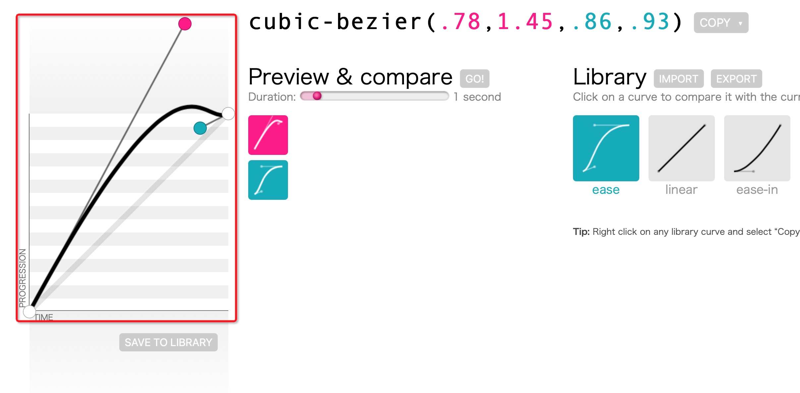

# 0001. 大白话入门CSS3动画

### A. 介绍

CSS3动画可是web前端中的灵魂。普普通通的DIV加上一个绚丽的动画，瞬间就能提升档次（高端的动画往往只需要最普通的DIV），今天我们就来聊聊这个CSS3动画到底怎么用~

写CSS3动画，我们可以看成是拍戏，分三步：

> 1. 先定一下主角
> 2. 然后写好剧本
> 3. 让主角开始演戏

今天，我们就通过【一个“球球”来演一场“来回滚动”的戏】来学习CSS3动画吧


### B. 分布调研

#### 1. 定主角：创建动画元素对象

今天，我们的目标是做一个球球能来回滚动，那么球就是这个主角，也就是动画元素对象。我们现在创建一个美丽的球（DIV）：

```html
<div class="animate-object-00">我是一<br>个球😁</div>
```

然后我们定一下这个主角“球”的外观，包括“高矮胖瘦”、等等等……，然后我们告诉他“先站在镜头的的左上角”。球以外的代码没有贴出来。球的舞台（就是球球的父层DIV）别忘了设置`position: relative;`

```css
.animate-object {
  width: 100px;
  height: 100px;
  font-size: 12px;
  border-radius: 50px;
  background: #7cd460;
  color: #ffffff;
  display: flex;
  flex-direction: row;
  align-items: center;
  justify-content: center;
  position: absolute;
  left: 0;
  top: 0;
}
```

此时，镜头📹前的画面是这样的……


#### 2. 写剧本：定义动画效果

这时候你变身成为一个编剧，开始“写剧本”。这个剧本格式是有要求的，不能随便写，必须完全按照语法来，否则导演（浏览器）和演员（咱们这里的球球DIV）看不懂剧本，不知道该怎么演。这个剧本就是CSS3的@keyframes动画。我们看看动画**@keyframes**的语法吧。**注意注意，这个是CSS3的的功能！**

```css
@keyframes 动画名称
{
  动画关键帧百分比1   {你的CSS样式}
  动画关键帧百分比2   {你的CSS样式}
 	...
  动画关键帧百分比N   {你的CSS样式}
}
```

我们看看这个格式中的几个组成部分（为啥是这个格式？制定标准的大神们决定的，我也没办法。你就死记硬背吧！😢），如果没看懂的话，我们把内容换成“剧本”你应该就能明白了：

```css
@keyframes 剧本名称
{
  场景1   {演员此时表演抬头的动作}
  场景2   {演员此时表演低头的动作}
 	...
  场景2   {演员此时表演立正的动作}
}
```

- 动画名称

这个不用细说了，随便起一个好听（**有意义**）的名字吧

- 动画关键帧的百分比

一个动画不可能就一帧，那就不叫动画了，所以这里最少得有俩，比如说：`0%`， `100%`。

当然你也可以写`from`h和`to`，和`0%` ，`100%`一个效果。这都无所谓，都是6个字符，没省啥事。

假如你想做更牛、更复杂的动画，那可能会很多帧，比如说`0%`，`10%`，`20%`，`30%`...`100%`

不是说为了60个关键帧（场景）才能做出60帧流畅的动画效果，你写几个关键帧都行，浏览器会给你补帧的。

- 你的CSS样式

这里就没啥可说的了，就是描述这一帧的时候，你的动画对象长什么样，多宽，多高，啥颜色等等等....

> 整体这部分可以理解成我们在写剧本的一个一个场景，剧本中的内容告诉演员，什么场景下你该化什么妆，表演什么动作，浏览器补帧的过程就是剧本之外演员“自由发挥”的过程

好了，格式了解清楚了，我们开始操刀造一个动画剧本。定两个关键帧

第一帧：初始状态0%，球球站在在最左边，身上颜色是柠檬淡绿色

第二帧：动画执行到最后100%，让他走到距离左侧500px的位置（球球宽500px，整个舞台600px，距左侧500px实际上看起来就是走到了最右侧），颜色变成柠檬淡黄色。然后指定他这个时候旋转了360度。这里我们在0%的关键帧里面没有指定旋转角度，那么浏览器会认为就是旋转0度，而100%的关键帧里面是旋转360度，那么从第一帧到第二帧的过程中，浏览器就会自动的帮我们补帧，动画让球球旋转360度就是一圈啦，是不是很方便~

```css
@keyframes keepMoving00 {
  0% {
    left: 0;
    background: #7cd460;
  }
  100% {
    left: 500px;
    background: #7cd460;
    transform: rotate(360deg);
  }
}
```


#### 3. 开始表演! ：应用动画到元素对象上

好了，动画流程（相当于剧本）写好之后，接下来我们该让演员表演了。我们怎么把表演的方式告诉演员呢？同样我们得按照规定的属性来写。我们先看看W3CSchool中定义的这些属性及用法（点击属性名称可以直接跳到W3School中看详细页面）。

| 属性                                                         | 描述                                                     |
| :----------------------------------------------------------- | :------------------------------------------------------- |
| [animation](https://www.w3school.com.cn/cssref/pr_animation.asp) | 所有动画属性的简写属性，除了 animation-play-state 属性。 |
| [animation-name](https://www.w3school.com.cn/cssref/pr_animation-name.asp) | 规定 @keyframes 动画的名称。                             |
| [animation-duration](https://www.w3school.com.cn/cssref/pr_animation-duration.asp) | 规定动画完成一个周期所花费的秒或毫秒。默认是 0。         |
| [animation-timing-function](https://www.w3school.com.cn/cssref/pr_animation-timing-function.asp) | 规定动画的速度曲线。默认是 "ease"。                      |
| [animation-delay](https://www.w3school.com.cn/cssref/pr_animation-delay.asp) | 规定动画何时开始。默认是 0。                             |
| [animation-iteration-count](https://www.w3school.com.cn/cssref/pr_animation-iteration-count.asp) | 规定动画被播放的次数。默认是 1。                         |
| [animation-direction](https://www.w3school.com.cn/cssref/pr_animation-direction.asp) | 规定动画是否在下一周期逆向地播放。默认是 "normal"。      |
| [animation-play-state](https://www.w3school.com.cn/cssref/pr_animation-play-state.asp) | 规定动画是否正在运行或暂停。默认是 "running"。           |
| [animation-fill-mode](https://www.w3school.com.cn/cssref/pr_animation-fill-mode.asp) | 规定对象动画时间之外的状态。                             |

我们用大白话讲一讲，方便大家理解：

- animation-name：关联的动画定义名称（就是你刚才写的剧本的名字）
- animation-duration：整个动画关键帧（动画执行的一个周期）全播放一遍的总时长（可以理解成这个剧本演一遍，要花多长时间）
- animation-timing-function：整个动画的执行速度曲线函数。这个有几种默认的缓动动画函数，也可以自定义速度的贝塞尔曲线（可以理解成电影的整体剧情怎么进行，什么时候剧情进展快一点，什么时候剧情进展慢一点。是开头剧情演的快，还是电影最后几分钟的时候剧情突飞猛进。这里大家不用纠结这个参数到底怎么用，是什么意思，下面举一反三中我们会详细说明，现在实在看不懂的话先跳过，继续往下看~）
- animation-delay：动画执行开始之前延迟多长时间（可以理解成主角开始动之前先摆个造型，让观众小激动一下，比如导演让电影一开场的时候，主角抬头45°望天不动30秒，那么这里就写30s）
- animation-iteration-count：动画需要播放几遍就写几，主要要写大于0的数，否则动画将不播放了，如果想一直播放下去就写`infinite`（可以理解成这个剧本需要演员重复演多少次，如果写了`infinite`，那么这个演员就一直一直不吃饭不睡觉重复演着剧本，这个有点……不太符合现实生活，哈哈哈）
- animation-direction：动画执行的下一周期是不是需要倒放一次。不需要的话属性值写`normal`，如果需要那么写`alternate`。注意这里说的是下一周期哈，即动画执行的偶数（2、4、6、8....）周期是反着执行动画剧本，假如`animation-iteration-count`设置的是1，那这个属性就不起作用，。如果设置的是3，那么就相当于正放两次，只倒放一次，以此类推。（可以理解成，是否需要按照剧本每演完一次之后，再倒着演一次😭）（这里我们再举一个其他场景的例子，大连 开往 北京的高铁列车，如果：`animation-direction: normal`，那么相当于大连要源源不断的发车开往北京，而北京不会有车开回来。如果：`animation-direction: alternate`，那么相当于大连的高铁列车开往北京后，北京会把这趟列车再开回大连，然后再从大连开往北京，如此往复循环）

- animation-fill-mode：动画播放完，动画元素（演员）是什么状态，播放完指的是`animation-iteration-count`这些个周期都执行完毕。（可以理解成，演员在演了`animation-iteration-count`遍剧本之后，是停留在剧本最后一个动作不动，还是还原到头演之前的动作。这里我们在下一节中通过动图来做一个示例，大家就明白不同的参数最后是什么效果了）

- animation-play-state：动画的播放状态，paused暂停，running播放。我们可以通过动态的变成这个CSS属性，达到播放、暂停动画的效果。（你可以想象成是电脑视频播放器的暂停、播放键）

- animation：动画简洁指令。这个放到最后说，是因为这个是上面**前七个**属性的混合用法。就是不想写那么多行代码的时候，用这个，一行就搞定。格式如下：

  ```css
  animation: animation-name animation-duration animation-timing-function animation-delay animation-iteration-count animation-direction animation-fill-mode;
  翻译过来就是：
  animation: 剧本名字 动画时长 速度函数 播放前的延迟时长 动画重复播放的次数 偶数周期用不用倒放 动画结束后的动画元素停留方式;
  ```

当然，如果你不需要把每个参数都定义出来（使用它的默认值），那么直接在书写animation字段的时候将他忽略掉就可以了。

码了一大堆文字，估计又难以理解了，我们现在实际操作一下。


此时我们的球球还站在舞台左上角，等待导演的ACTION命令，现在给我们的DIV球球下达指令：

keepmoving00这个剧本演两次，每次演完后都倒着再演一次（相当于一共演4次，两次正的，两次反的），每次剧本内容要2秒钟演完，剧本的进度要完全线性速度（整体剧情进展的速度都是一致的，这样的速度表演的话，我们要设置`animation-timing-function: linear`，这个参数还有哪些设置方式我们稍后在详细讲解，你现在只需要知道这样设置动画会一直以一样的速度往前进行即可）。第一次开始演之前先等待两秒钟。

这些命令转换成CSS的代码就是（我们给球球单独新加了个class`animate-object-00`，来描述动画执行参数）：

```css
.animate-object-00 {
  /*...之前的样式...*/
  animation-name: keepMoving00;
  animation-duration: 2s;
  animation-timing-function: linear;
  animation-delay: 2s;
  animation-iteration-count: 4;
  animation-direction: alternate;
}
```

足足六行代码，我们给它压缩成一行，用animation属性来写就是下面这样，这里我们忽略了最后一个参数`animation-fill-mode`，使用了它的默认值，即最后执行完回到元素动画执行前状态：

```css
.animate-object-00 {
  /*...之前的样式...*/
  animation: keepMoving00 2s linear 2s 4 alternate;
}
```

是不是看起来整洁多了，但肯定有人会觉得这样很难一眼看出来每个字段是干嘛的，不如上面六行代码看着清晰。我最开始也是这样，但是动画写多了就好了……，熟能生巧（接下来我们都尽量通过这样animation一行的方式来表达此刻的动画属性）。

我们现在来看看镜头前的小球是什么样的（为了方便大家知道动画到底循环了几次，我在动图中加上了个时钟）：


到现在为止，我们就成功的完成了我们的第一个CSS动画~，接下来我们举一反三，看看更改各种属性，最后效果是什么样的，特别是`animation-fill-mode`，我们给大家分别演示一下，聪明的你应该一看就会懂了~


### C. 举一反三

这节主要是

#### 1. @keyframes多增加一个关键帧

我们复制一个刚才的动画“剧本”命名为`keepMoving01`，然后在其基础上，增加一个动画执行到50%的关键帧，将其CSS样式设置为背景色是黑色，动画执行参数不变。代码如下：

```css
@keyframes keepMoving01 {
  0% {
    left: 0px;
    background: #7cd460;
  }
  50% {
    background: #333333;
  }
  100% {
    left: 500px;
    background: #fbe760;
    transform: rotate(360deg);
  }
}
.animate-object-01 {
  animation: keepmoving01 2s linear 2s 4 alternate;
}
```

这个时候，球球一开始是淡绿色，球球滚动到一半的时候，会变成黑色，滚动到最右侧的时候会变成淡黄色：


由此可见，我们只需要规定动画执行过程的百分比，然后设置这个场景下的CSS样式后，浏览器就会自动的帮我们完成超级炫酷的补帧了，非常的方便~


#### 2. 调整动画duration和delay属性

我们再测测改变`animation-duration`和`animation-delay`字段，会影响动画的哪些效果。我们将动画调快到1秒钟执行完成，然后延迟调整为4秒钟，此时的代码和效果分别为：

```css
.animate-object-02 {
  animation: keepMoving01 1s linear 4s 4 alternate;
}
```


可以看到，动画前的等待时间变长了，然后`animation-duration`的值缩短后，动画变得快了起来。


#### 3. 调整timing-function对比一下效果

CSS3提供了几种自定的速度曲线描述函数，分别是：linear、ease、ease-in、ease-out、ease-in-out。除此之外还提供了一个可以自定义动画曲线的CSS函数，我们先写一个小例子，再看看动图，对比一下他们的效果有什么不同：

```css
.animate-object-03 {
  animation: keepMoving01 3s linear 2s 4 alternate;
}
.animate-object-04 {
  animation: keepMoving01 3s ease 2s 4 alternate;
}
.animate-object-05 {
  animation: keepMoving01 3s ease-in 2s 4 alternate;
}
.animate-object-06 {
  animation: keepMoving01 3s ease-out 2s 4 alternate;
}
.animate-object-07 {
  animation: keepMoving01 3s ease-in-out 2s 4 alternate;
}
.animate-object-08 {
  animation: keepMoving01 3s cubic-bezier(.17,.67,.41,1.67) 2s 4 alternate;
}
```


通过动画效果，我们可以看出来不同的`animation-timing-function`所带来的的动画执行速度效果是不一样的：

- linear：表示动画速度一直是同样的速度，匀速的在执行
- ease：表示动画刚开始速度略慢，然后猛的加速，然后逐渐变慢，最后停下来
- ease-in：表示动画刚开始执行很慢，然后逐渐加速，到最后停下来，但是直到停下来都没有进行过任何减速
- ease-out：表示动画刚开始就直接进行加速，然后逐渐变慢，最后停下来，他和ease类似，但是细看在加速和减速的速度上还有些差别
- ease-in-out：表示动画刚开始的的时候 逐渐加速，然后快到头的时候逐渐减速，最后停下来
- cubic-bezier(.17,.67,.41,1.67)：嗯？怎么回事，他们跑舞台外面去了？我们接下来看看怎么回事

首先我们打开这个网站`https://cubic-bezier.com`，可以看到网站右侧有这么几个小图：


每个图下面还有个名字，啊，这不正是``animation-timing-function``中CSS3默认提供的五个枚举名字吗？由此可见，其实ease等这五个自带的函数，实际上也就是`cubic-bezier`预制好的贝塞尔曲线。我们翻看一下W3C文档就可以知道，他们对应的贝塞尔曲线关系如下：

```css
linear:  cubic-bezier(0,0,1,1);
ease: cubic-bezier(0.25,0.1,0.25,1);
ease-in: cubic-bezier(0.42,0,1,1);
ease-out: cubic-bezier(0,0,0.58,1);
ease-in-out: cubic-bezier(0.42,0,0.58,1);
```

`cubic-bezier()`括号中的数字可能我们看不太懂，但是无所谓，我们能看懂曲线图就好了。曲线图的纵坐标Y轴，表示动画的执行进度，横坐标X轴标识动画执行时间线，这样我们就可以得出X在同样短的范围内Y升高的越多，动画执行的就越快。可能听起来还是晕晕的，那就总结成一句话吧，这个曲线越陡，动画执行的越快，曲线越缓，动画执行越慢。

既然CSS3自带的效果都是用cubic-bezier可以来实现的，那么也就是说我们可以通过cubic-bezier来随意自定义自己的动画效果。我们光看这个数值可能看不太懂，我们直接使用刚才的那个网站左侧的曲线拖动功能，直接手动的画曲线。回顾一下刚才动图中最后一个球球跑舞台外面那个，我们把CSS中用到的贝塞尔曲线参数直接通过锚点方法加载进来，就可以在左侧看到这个参数对应的曲线：

>  https://cubic-bezier.com/#.17,.67,.41,1.67

打开后，可以看到界面上是上图这样的，这个曲线的Y轴冒出到外面去了。联系到刚才咱们介绍的`曲线图的纵坐标Y轴，表示动画的执行进度`，可以看出，画出来的曲线如果超过Y轴的话，那么最后实际执行的动画就会超出预计的范围。大家可以自己尝试拖动曲线，然后放到代码里面测试一下。

> 说明：咱们的本篇文章涉及到的所有示例代码均在这里哦，你可以将代码下载下来进行修改、测试：
>
> https://github.com/lemon-full-stack/web/blob/main/0001/code/index.html

有了这个曲线画图工具，我们就可以自定义出任意我们想要的动画速度效果了，比如：我们把曲线最后稍微弄一些在Y轴顶部的小波动，即可做出来略微有一些惯性的效果，这样我们的动画看起来就更加贴近现实世界：



为了更加真实，我们把动画改成仅执行一次，同时关掉了偶数周期动画倒放的设置（实际上动画只执行一次已经可以达到这个禁用倒放的效果了），然后让最后动画执行完，停留在结束的原地：

```css
.animate-object-09 {
  animation: keepMoving01 3s cubic-bezier(.78,1.45,.86,.93) 2s 1 normal forwards;
}
```

最后动画效果我们看一下：


大家多加练习，相信以各位的聪明才智，再加上各位的审美，可以做出更加漂亮的动画~


#### 4. animation-fill-mode到底会影响什么

我们再看看`animation-fill-mode`属性，这个属性的可选值有四种：forwards，backwards，both，none。我们做个实验，对比一下他们有什么不同。我们先将原来的动画“剧本"复制一份，命名为keepMoving02，然后我们原来0%的关键帧中的颜色从原来的淡绿色改成红色#ff0000，这里我们注意下哈，原来动画元素的默认样式中的background字段我们仍是淡绿色不变，代码如下：

```css
@keyframes keepMoving02 {
  0% {
    left: 0;
    background: #ff0000;
  }
  50% {
    background: #333333;
  }
  100% {
    left: 500px;
    background: #fbe760;
    transform: rotate(360deg);
  }
}
.animate-object {
  width: 100px;
  height: 100px;
  font-size: 12px;
  border-radius: 50px;
  background: #7cd460;
  color: #ffffff;
  display: flex;
  flex-direction: row;
  align-items: center;
  justify-content: center;
  position: absolute;
  left: 0;
  top: 0;
}
```

接着我们造出来四个小球球，分别给定四种`animation-fill-mode`，注意：这四个动画我都设置了2s的延迟执行，这点很重要，因为不同的`animation-fill-mode`属性值，其在延迟执行范围内展现的样式 是不同的：

```css
.animate-object-09 {
  animation: keepMoving02 3s cubic-bezier(.78,1.45,.86,.93) 2s 1 normal forwards;
}
.animate-object-10 {
  animation: keepMoving02 3s cubic-bezier(.78,1.45,.86,.93) 2s 1 normal backwards;
}
.animate-object-11 {
  animation: keepMoving02 3s cubic-bezier(.78,1.45,.86,.93) 2s 1 normal none;
}
.animate-object-12 {
  animation: keepMoving02 3s cubic-bezier(.78,1.45,.86,.93) 2s 1 normal both;
}
```

然后我们对比一下最后四种属性值的不同效果：


我们通过动图可以总结出如下的规律：

- forwards：动画在延迟duration执行过程中使用的是元素的默认CSS样式（淡绿色），延迟结束后才变为0%关键帧的样式（红色），最后执行完毕停留在100%关键帧的样式（淡黄色）
- backwards：在动画延迟duration执行过程中就已经将样式修改成0%关键帧（红色）的样式，动画执行过程中逐渐变成最后100%关键帧的样式（淡黄色），执行完毕后马上还原成动画元素默认CSS样式（淡绿色）
- none：在动画延迟duration执行过程中使用的是元素的默认CSS样式（淡绿色），延迟结束后才变为0%关键帧的样式（红色），执行完毕后马上还原成动画元素默认CSS样式（淡绿色）
- both：在动画延迟duration执行过程中就已经将样式修改成0%关键帧（红色）的样式，动画执行过程中逐渐变成最后100%关键帧的样式（淡黄色），最后执行完毕仍然停留在100%关键帧的样式（淡黄色）

这段文字读起来很绕口，但是实际上挺简单的，总结起来其实就是个排列组合，如下表格：

| animation-fill-mode      | 动画结束后保留100%关键帧样式 | 动画结束后还原为默认样式 |
| :----------------------- | :--------------------------- | ------------------------ |
| 延迟阶段使用默认样式     | forwards                     | none                     |
| 延迟阶段使用0%关键帧样式 | both                         | backwards                |


#### 5. 通过animation-play-state操作动画播放状态

我们前文中介绍到了animation-play-state属性的作用，但是一直没有实际演示怎么用他。在这我们就来实际操作一波。首先，抛开JS，单纯的使用CSS来操作他。我们创建一个小球球，然后让他默认是暂停的状态，鼠标悬浮事件`:hover`中，我们将其设置为runnig状态，为了看效果，我们吧延迟给去掉了，然后让他无限重复动画滚动：

```css
.animate-object-13 {
  animation: keepMoving02 3s cubic-bezier(.78, 1.45, .86, .93) infinite alternate both;
  animation-play-state: paused;
}

.animate-object-13:hover {
  animation-play-state: running;
}
```

这样就可以做到如下的效果（有点像鼠标推着球在走哈，各位可以发挥自己的想象创作各种好看的动画）：


除了CSS，我们还可以通过JS来控制动画的暂停和播放。其实就是动态的通过JS来修改CSS的属性值，我们先来创建两个按钮：

```html
<button id="play-btn">播放</button>
<button id="pause-btn">暂停</button>
```

然后，给两个按钮添加点击事件：

```js
window.onload = function () {
  document.getElementById('play-btn').onclick = function () {
    document.getElementsByClassName('animate-object-14')[0].style.animationPlayState = 'running'
  }
  document.getElementById('pause-btn').onclick = function () {
    document.getElementsByClassName('animate-object-14')[0].style.animationPlayState = 'paused'
  }
}
```

然后我们让这个小球球是始终无限循环滚动的：

```css
.animate-object-14 {
  animation: keepMoving02 3s cubic-bezier(.78, 1.45, .86, .93) infinite alternate both;
}
```

最后就可以实现如下这个效果啦：


### C. 总结

整体看来，CSS3的动画复杂的地方主要是应用动画时候的CSS属性设置，我们再整体总结一下：

```css
animation-name: 指定用哪个动画剧本，就改这个属性
animation-duration: 想控制动画几秒钟播放完毕（播放速度有多快），就改这个属性
animation-timing-function: 想不让动画匀速播放就设置这个属性
animation-delay: 最开始想让动画延迟几秒播放，就改这个属性
animation-iteration-count: 想设置动画重复播放几次，就改这个属性
animation-direction: 想设置动画有倒放效果，就设置这个属性
animation-fill-mode: 想设置动画播放前（延迟时间内）和播放后用哪套样式，就改这个属性
animation-play-state: 想暂停、播放动画，就设置这个属性
```
今天这篇文章实际上只算是一个入门，CSS3的动画在组合起来实际上可以做出更加炫酷的效果，我们以后找个时间再往深了唠唠高级点的应用~

怎么样，你学会了吗？如果还有疑问，可以加我微信：LemonITCN
